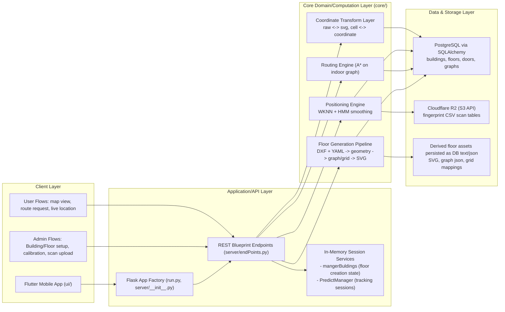
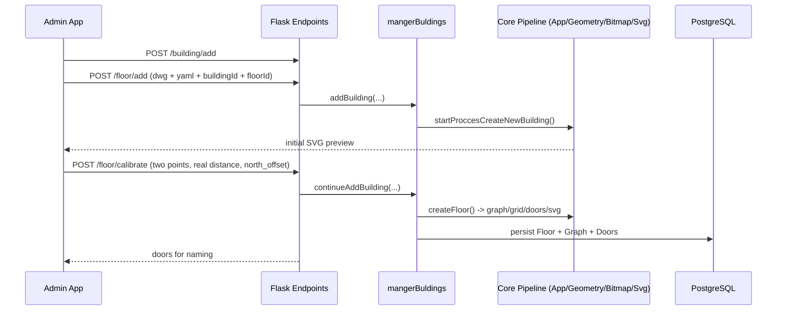
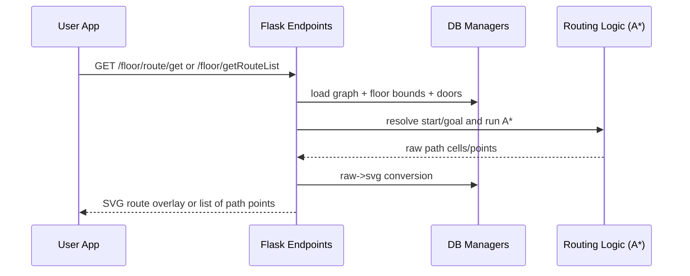
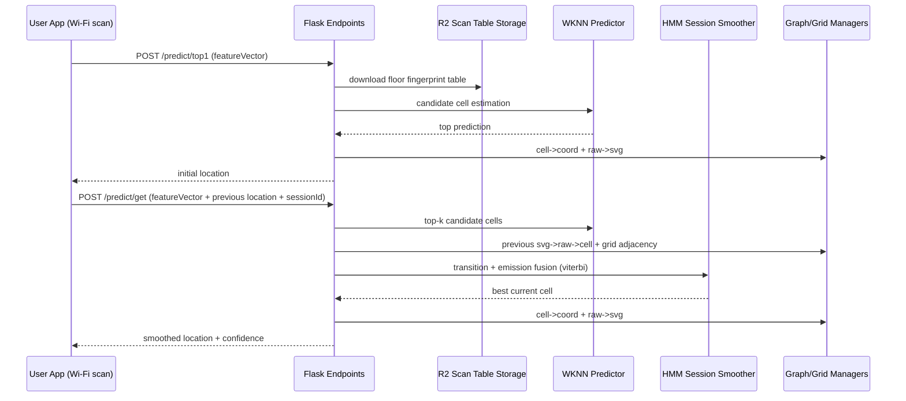
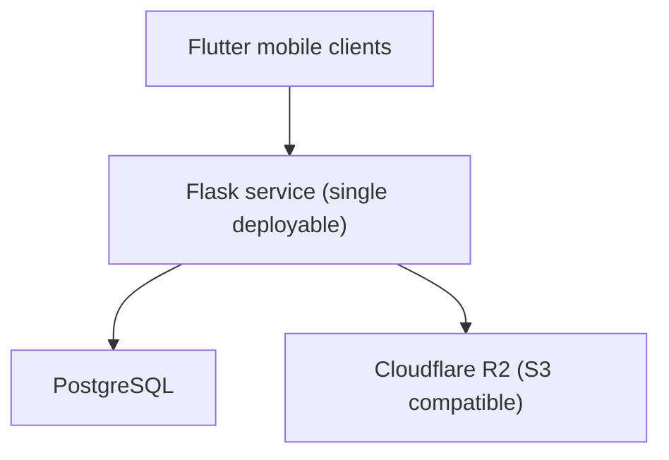

# Project High-Level Architecture Graph (Interview Version)

## 1) One-Screen High-Level Graph

---

## 2) Core Runtime Flows (High-Level, but complete)

### A. Floor Onboarding Flow (Admin)

### B. Navigation Route Flow (User)

### C. Real-Time Positioning Flow (User)

---

## 3) Component Responsibilities

- `ui/`: Flutter app for admin setup and user navigation/location UX.
- `server/endPoints.py`: orchestration layer, API contract, request/response handling.
- `server/DataBaseManger/*`: persistence adapters for floors, graphs, doors, and files.
- `core/`: computational heart (CAD parsing, geometry extraction, graph/grid creation, path operations, SVG ops).
- `core/predict/wknn_service.py`: Wi-Fi fingerprint inference against cached floor scan tables.
- `core/predict/hmm_model.py` + `server/predictManager.py`: short-lived session smoothing for continuous movement.

---

## 4) Data Model Snapshot (High-Level)

- `Building`: metadata (`id`, `name`, `city`, `address`).
- `Floor`: calibrated map artifacts and bounds (`svg_data`, `grid_svg`, `x/y min/max`, `one_cm_svg`, `north_offset`).
- `Door`: indoor landmarks and names (raw + scaled coordinates).
- `Graph`: serialized navigable graph + cell mappings + grid adjacency.
- Fingerprint datasets: CSV files in Cloudflare R2 per `building/floor`.

---

## 5) Deployment/Infra View

- Current architecture is a modular monolith (cleanly separated by domain packages).
- Easy evolution path: split prediction and floor-processing pipelines into dedicated services later.

---

## 6) Overview

This system is a Flutter client talking to a Flask backend that acts as an orchestration layer.
At a high level, we have three core capabilities: floor onboarding, routing, and live positioning.
For onboarding, CAD files are processed into indoor graphs and SVG assets, then persisted.
For routing, the API pulls graph data and computes shortest indoor paths, returning SVG overlays or route points.
For positioning, we combine Wi-Fi fingerprint matching (WKNN) with session-aware HMM smoothing for stable movement.
PostgreSQL stores building/floor/graph metadata, while Cloudflare R2 stores larger scan-table CSV datasets.

---

## 7) File Map

- Entry point: `run.py`
- App bootstrap: `server/__init__.py`
- API surface: `server/endPoints.py`
- Domain computation: `core/app.py`, `core/GeometryExtractor.py`, `core/ManagerFloor.py`, `core/SvgManager.py`
- Prediction: `core/predict/wknn_service.py`, `core/predict/hmm_model.py`, `server/predictManager.py`
- Persistence: `server/models.py`, `server/DataBaseManger/floorManager.py`, `server/DataBaseManger/graphManger.py`, `server/DataBaseManger/filesManager.py`
